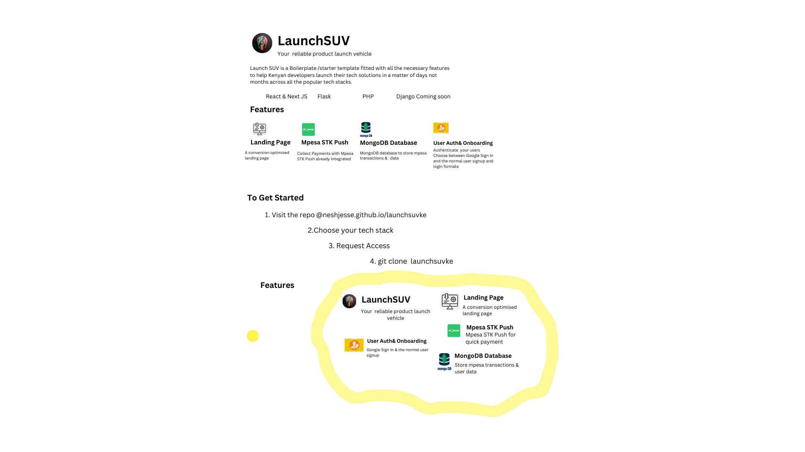
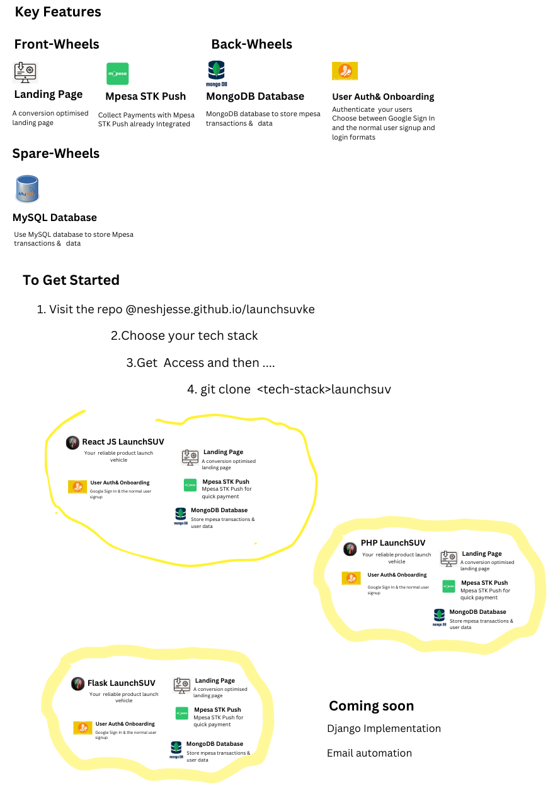
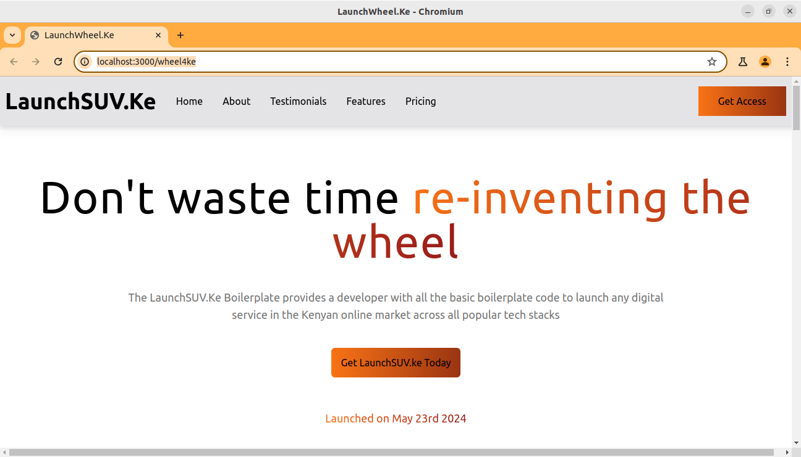
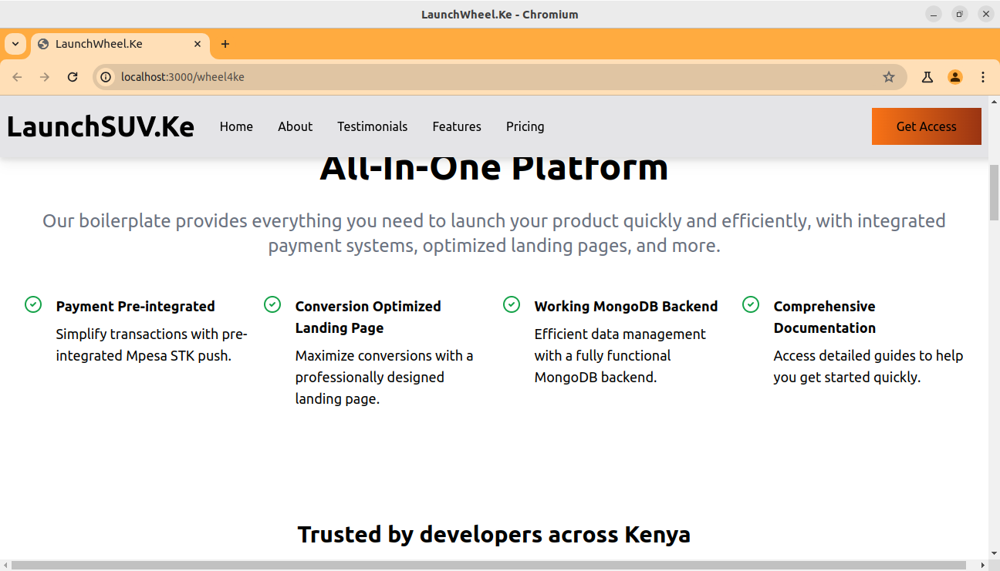
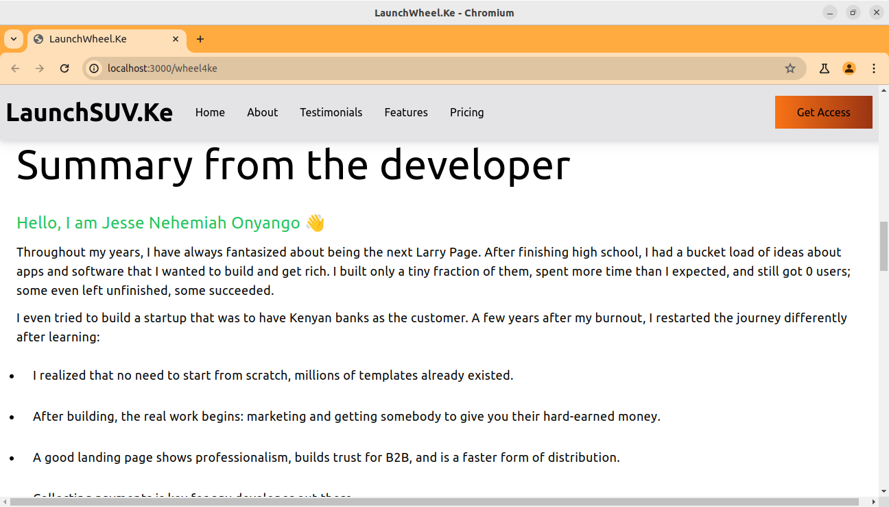
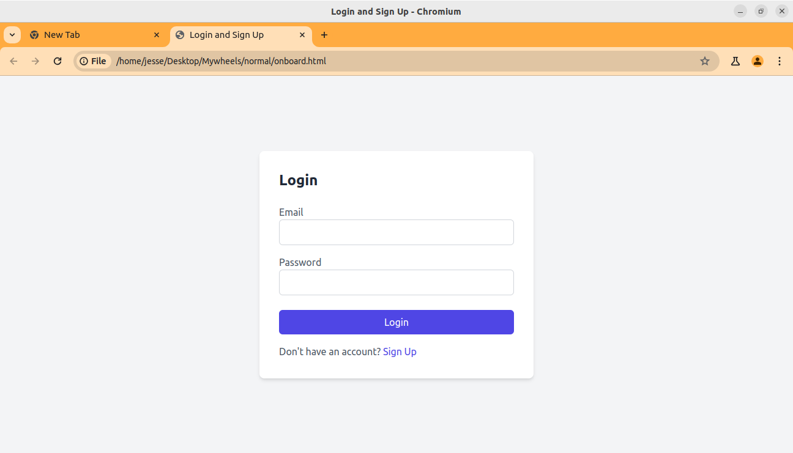
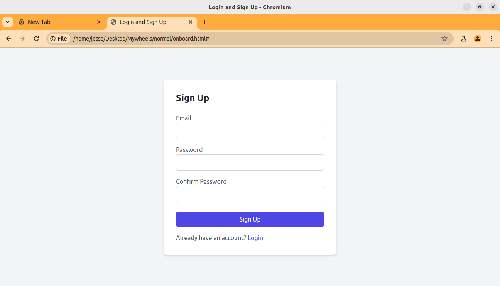
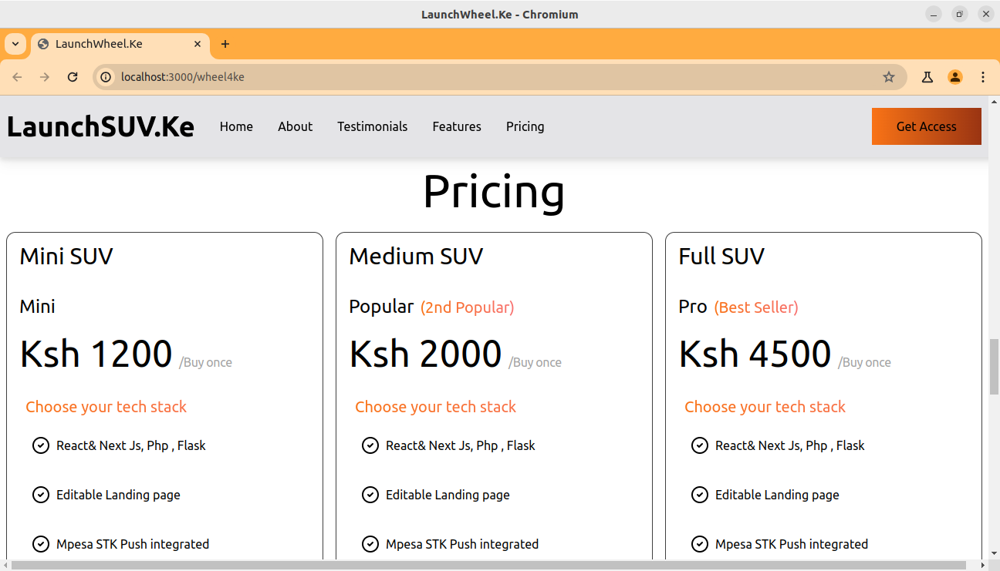
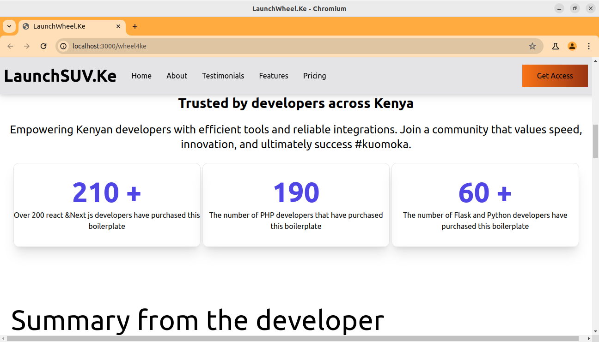
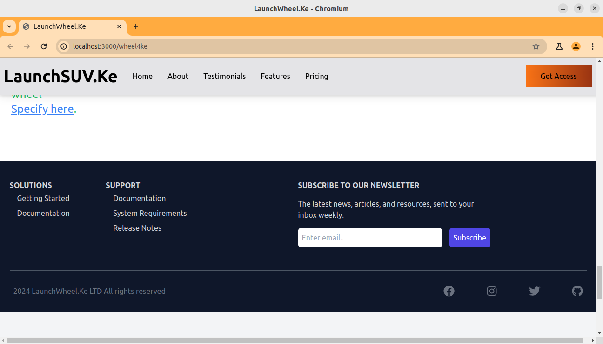

## STAR THE REPO AND FOLLOW ME GODDAMIT
This is the React Js Boilerplate

Launch your solution as fast as possible
The Boilerplate with all the necessary features a Kenyan developer needs to launch their side projects and commercial solutions
## OVERVIEW

1.HERO SECTION

2.FEATURES

3.DEVELOPER SECTION

4.LOGIN

5.SIGNUP

6.PRICING

7.PROOF

8.FOOTER

 
Backend Directory for the Mpesa API 
Backend with Database for mpesa also

## PROJECT STRUCTURE
1.Public

2.Src
  1.Components/-Every component has a plethora of comments that tell you what the section does.
  There are duplicates of components that allow you to chose the best version of what you want
   * About.jsx - 
   * Allinone.jsx
   * Developer.jsx
   * Features.jsx
   * Footer &Footers.jsx
   * Herosection.jsx
   * Login.jsx //this handles signup and login front-end all at once.
   * Navbar.jsx
   * Payform.jsx
   * Pricing.jsx
   * Workflow.jsx
  3.Constants/ 
    * index.jsx //this feeds data to features,pricing sections of the landing page
    * mpesapay.js//this code snippet handles form submission for payform.jsx
   it needs you to copy paste it to the paymentform,jsx.it in localhost:5000 backend
  * Assets
* App.js
* package.json

Contributions ACCEPTED
## DONT FORGET TO FOLLOW

   * Facebook: Jesse Nesh

   * Instagram: itsjesse.nehemiah

   * LinkedIn: Nehemiah Onyango

  * WhatsApp: +254 702337041

## SUPPORT US BY

* Star this project 
* Follow me on GitHub
* Invite others to USE the boilerplate

